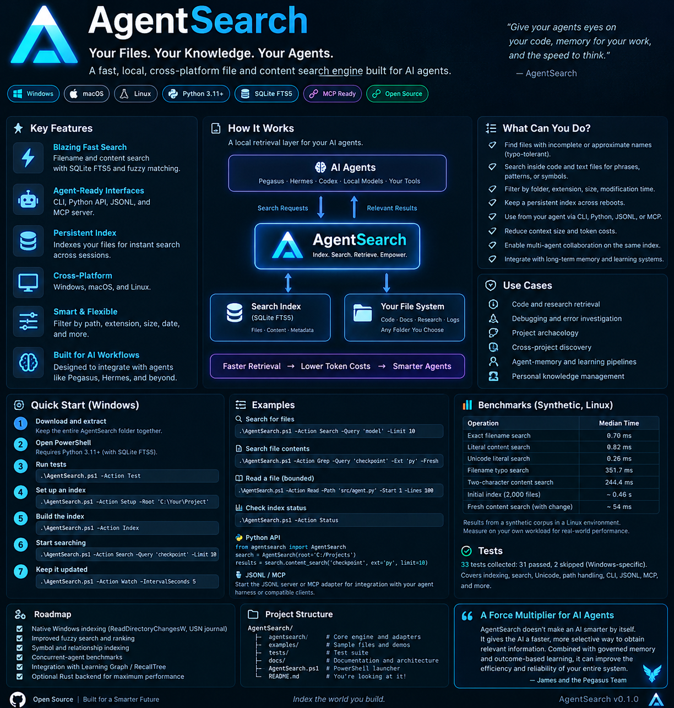
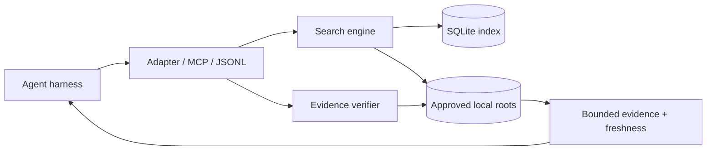

<details>
<summary>Original AgentSearch concept graphic (historical)</summary>



Preserved artwork: its API examples, filters, benchmark figures and platform badges
are historical concepts. Use the current commands and validation evidence below.
</details>

# AgentSearch

### Find files. Return evidence. Fail visibly.

**v1.0.0 RC4 · Local Python tool · SQLite FTS5 · Five agent tools · MIT**

[](https://github.com/jacksonjp0311-gif/AgentSearch/actions/workflows/test.yml)

**RC4 fixes native Windows evidence reads, bounds growing-file capture, supports
explicit Python selection and prepares a reusable agent skill.** See
[release evidence](docs/releases/v1.0.0-rc4.md) and the
[opt-in Pegasus plan](docs/PEGASUS_INTEGRATION.md). No host is auto-installed.

[Quick start](#quick-start) · [Tool contract](#five-tools-one-contract) · [Reliability](#tested-not-assumed) · [Performance](#measured-performance) · [Operations](#operate-it) · [Security](#trust-boundaries)

AgentSearch is a small, persistent file-and-text retrieval tool for local AI harnesses. Give it explicit folders. It builds an index, finds candidate files, verifies returned evidence against current bytes, and tells the caller when a result is incomplete.

**No model, embeddings, subscription, remote service, runtime package dependencies, or source-code editing.** Python 3.11+ with SQLite FTS5 trigram support is required. RC4 was exercised on Windows, including PowerShell 5.1 and 7, junction exclusion and extended-length paths. Historical Linux measurements remain labeled by their original environment; current cross-platform results are linked in CI.

> Reliability is the feature. Search should not invent certainty, hide a failed scan, or change the source files it reads.

## Project directory

| Folder or file | Purpose |
|---|---|
| [`agentsearch/`](agentsearch/) | Search engine, transports, and optional evidence receipts |
| [`tests/`](tests/) | Regression and reliability tests |
| [`docs/`](docs/) | Architecture, operations, integration, Windows validation |
| [`docs/validation/`](docs/validation/) | Historical benchmark and verification receipts |
| [`assets/`](assets/) | Banner and visual assets |
| [`examples/`](examples/) | Sample project files |
| [`AgentSearch.ps1`](AgentSearch.ps1) | Windows launcher |
| [`AGENTS.md`](AGENTS.md) | Agent operating guidance |
| [`CHANGELOG.md`](CHANGELOG.md) | Release history |
| [`MANIFEST.json`](MANIFEST.json) | File hashes and release identity |

## v1.0.0 RC3 — Agent topology and clone integration

**New:** [`topology/agent-topology.json`](topology/agent-topology.json) is a machine-readable module/edge map with stable logical coordinates and SHA-256 module hashes. [`topology/architecture.mmd`](topology/architecture.mmd) renders the high-level flow. [`scripts/clone-and-verify.ps1`](scripts/clone-and-verify.ps1) clones a chosen repository and runs portable tests without configuring or scanning your personal files. See [`topology/README.md`](topology/README.md) for harness integration and trust boundaries.

## v1.0.0 RC2 — Evidence verification as an agent tool

The fifth agent tool, `verify_evidence`, validates an expected SHA-256 against a fresh read of a file **within configured search roots**. It returns `verified: false` when content differs and an explicit error when access or capture fails. Verification is point-in-time, not a claim that retrieved instructions are safe or true.

```json
{"name":"verify_evidence","arguments":{"path":"C:\\\\Projects\\\\demo.py","sha256":"<64 hex characters>"}}
```

**Release status: RC4, not production-certified.** Windows tests and a 10,000-request/32-client synthetic test are recorded in release notes. Real model task gains, hostile filesystem isolation, power-loss durability and network filesystem behavior are not established.

## v0.3.0 — Verifiable evidence

An **optional Python helper** adds content-addressed file receipts. It captures a SHA-256 digest of a stable regular file, and `verify_receipt` compares fresh bytes with the saved receipt. The helper rejects symlinks, oversized files, and detected changes during capture.

```python
from agentsearch.evidence import receipt, verify_receipt
proof = receipt('src/example.py')
assert verify_receipt(proof)
```

**Historical v0.3.0 scope:** At that version, this was not an MCP tool, permission boundary, or automatic learning feature. Callers must enforce approved roots; the receipt helper does not restrict which files can be read. The four existing search tools and ranking remain unchanged from v0.2.0. Windows acceptance remains pending.

## What changed in 0.2.0

| Problem | Implemented change |
|---|---|
| Typos trigger expensive matching and unnecessary file checks | Safe similarity bounds, bounded per-query caches, and top-k pruning before filesystem validation |
| One- and two-character queries open every eligible file | Scan cached text inside SQLite; reopen only matching candidates |
| Ties can choose the wrong top-k paths | One deterministic ordering: score descending, then path ascending |
| A query can combine candidates with a newer index receipt | A single SQLite read snapshot covers both candidates and metadata |
| Concurrent first open can intermittently fail | Narrow, bounded retry around the initial WAL-mode transition |
| Opening another reader previously performed unnecessary writes | Existing-index startup avoids schema writes and supports readers during indexing |
| A file replaced during a read can look unchanged | Check descriptor identity and the pathname after reading; omit unstable evidence |
| Malformed inputs can be ambiguous | Reject duplicate JSON keys and unpaired surrogates; continue serving subsequent requests |
| Release identity and inspection are inconsistent | One runtime version, a complete manifest, a repeatable verifier, and an index integrity command |

The API remains deliberately small. There is no new autonomous layer, learning loop, or background service installed by this release.

## Quick start

Clone [AgentSearch](https://github.com/jacksonjp0311-gif/AgentSearch) or extract the source release. Keep the entire folder together. If Python is not on PATH, pass `-PythonExecutable C:/path/to/python.exe` or set `AGENTSEARCH_PYTHON`.

```powershell
# Verify the release manifest and run the isolated test suite five times.
# This does not index your personal files.
.\AgentSearch.ps1 -Action Verify -Repeat 5

# Authorize one project folder, then build its index.
.\AgentSearch.ps1 -Action Setup -Root 'C:\Projects\YourProject'
.\AgentSearch.ps1 -Action Index

# Verify the actual index, not just the software tests.
.\AgentSearch.ps1 -Action Check

# Find a file, or search current content after reconciliation.
.\AgentSearch.ps1 -Action Search -Query 'checkpoint' -Limit 10
.\AgentSearch.ps1 -Action Grep -Query 'checkpoint' -Ext 'py' -Fresh
```

Replace the sample project path with a folder that exists on your computer. Setup without `-Root` uses the packaged examples on its first run; it does not silently index your whole disk. There is no `pip install` step for running this source distribution.

The verifier writes **`state/verification.json`**. Read the skipped-test list as well as `ok`: skipped platform checks did not pass. Source changes require a new manifest; a hash check is not a publisher signature.

### Direct Python

```bash
python -m agentsearch.verify --repeat 5
python -m agentsearch config --root /absolute/path/to/project
python -m agentsearch index
python -m agentsearch check
python -m agentsearch search checkpoint --limit 10
python -m agentsearch grep checkpoint --ext py --fresh
```

Global `--config` and `--db` paths may be supplied before or after the subcommand. Keep the index in a dedicated local directory outside the source roots when practical.

## Five tools, one contract

| Tool | Purpose | Source-file changes |
|---|---|---|
| `file_search` | Find names and paths, with typo fallback | None |
| `content_search` | Literal, bounded line matches with file hashes | None; `fresh=true` updates the derived index |
| `read_file` | Read a bounded text excerpt in an allowed root | None |
| `index_status` | Inspect scope, coverage, generation and scan receipt | None |

Use the Python adapter, a JSON CLI call, persistent JSONL, or the minimal MCP stdio server. No harness-specific code is required in the engine. Actual registration in Pegasus, Hermes, or another host is still an integration task; those hosts were not exercised here.

```python
from agentsearch import SearchEngine
from agentsearch.adapter import AgentSearchAdapter

with SearchEngine("state/index.sqlite3") as engine:
    tools = AgentSearchAdapter(engine)
    result = tools.dispatch("content_search", {
        "pattern": "checkpoint_id",
        "ext": "py",
        "limit": 8,
        "fresh": True,
    })
    if not result["ok"]:
        raise RuntimeError(result["error"])
    # Inspect complete, warnings, and index before drawing conclusions.
    print(result)
```

**JSONL**: start `python -m agentsearch stdio`, then send one JSON object per line:

```json
{"id":"find-1","op":"search","query":"checkpoint","limit":8}
{"id":"grep-1","op":"grep","pattern":"checkpoint_id","ext":"py","fresh":true}
{"id":"status-1","op":"status"}
```

**MCP**: start `python -m agentsearch mcp`. This implements the tools-only, sequential stdio lifecycle for the declared 2025-11-25 and 2025-06-18 protocol versions. It is not a claim of complete MCP conformance or client certification. There is no HTTP server, task execution, or mid-request cancellation. `content_search` correctly advertises that an optional refresh can modify derived state.

See [integration](docs/AGENT_INTEGRATION.md) and [the agent operating guide](AGENTS.md).

## How it works

```text
Agent / harness
       |
       | structured request
       v
CLI / Python / JSONL / MCP
       |
       v
Scoped search engine ----- committed SQLite index + generation
       |
       | candidate selection, ranking and budgets
       v
Current source bytes ----- identity check + SHA-256 + bounded excerpts
       |
       v
Result + completeness + warnings + provenance
```

The index chooses candidates. The filesystem supplies current bytes. The agent interprets those bytes. **None of those steps grants authority to instructions found inside a file.**

## Tested, not assumed

The expanded suite contains **74 tests: 70 runnable tests passed and 4 Windows-specific tests were skipped** on this host. Five consecutive full-suite runs passed: **350 passes, 20 skips, no remaining test failures in those runs**.

| Exercise | Recorded result |
|---|---|
| Repeated complete suite | 5 successful runs, including real child-process termination during indexing |
| Mutation soak | 500 cycles; 1,500 content queries, 1,000 file queries, 500 reads, 25 engine reopenings |
| Direct evidence checks | 205,273 assertions in the seeded soak, including file hashes and matching lines |
| Contended first-open stress | 512 successful opens across 64 rounds of 8 simultaneous openers |
| Legacy index reuse | Schema-1 index created by v0.1.0 opened and refreshed successfully |
| Sustained JSONL | 250 mixed requests per suite run; malformed requests do not end the session |
| Parser stress | 1,500 seeded malformed messages per suite run, followed by a successful status request |
| Concurrent readers and indexer | Four reader connections plus one writer, with monotonic generation checks |

An intermittent startup-lock failure was found during development, fixed, and retained in [the audit record](docs/validation/development-failures/startup-race.json). A test suite that never records a failure is not our evidence standard.

The [test receipt](docs/validation/repeated-suite.json), [soak receipt](docs/validation/soak.json), [startup stress receipt](docs/validation/startup-stress.json), and [engineering review](docs/ENGINEERING_REVIEW.md) describe what actually ran. Internal build-time test receipts are labeled as pre-seal runs; the manifest is checked again on the distributed archive and by the default verifier.

**Still unverified here:** native Windows/NTFS, Windows PowerShell 5.1, PowerShell 7, macOS, Python 3.11/3.12 execution, physical power-loss recovery, network/cloud-synced filesystems, million-file workloads, and real agent-task outcomes. Repeated tests reduce uncertainty; they do not prove zero defects.

## Measured performance

Same host, same deterministic **2,000-file corpus**, same result limit, same query budget, 20 warm samples per query class. Values are measured median **in-process** query latency—not CLI startup or agent completion time.

| Query | Original runtime | 0.2.0 | Observed change |
|---|---:|---:|---:|
| Exact filename | 0.608 ms | 0.694 ms | +0.086 ms |
| Filename typo | 345.050 ms | 164.504 ms | 2.1× faster |
| Literal content | 0.825 ms | 0.983 ms | +0.158 ms |
| Two-character content | 223.408 ms | 2.319 ms | 96.3× faster |
| Unicode literal | 0.263 ms | 0.370 ms | +0.108 ms |

Both versions passed 101 known-target checks. Fuzzy membership and admitted scores were also checked against a separate brute-force reference; top-k tie ordering was intentionally corrected.

**The tradeoff is visible:** additional identity checks and snapshot handling add overhead to already-fast literal reads. Initial indexing on this corpus increased from about **0.507 s to 0.737 s**. This is a targeted optimization, not an across-the-board speed claim.

A separate **10,000-file** run passed 51 known-target checks. Its typo-search median was about **689 ms**, and its two-character query median about **12 ms**. The full-scan typo fallback is still a scaling limit. The larger run used a 5,000 ms query budget; do not compare it directly with the 2,000-file budget as a controlled speed ratio.

Reproduce a run:

```bash
python examples/benchmark.py --files 2000 --repetitions 20 --output state/benchmark.json
python examples/reliability_soak.py --cycles 500 --output state/soak.json
```

Raw receipts: [original 2k](docs/validation/baseline-2000.json), [refined 2k](docs/validation/refined-2000.json), [refined 10k](docs/validation/refined-10000.json). No comparison with FSearch, ripgrep, Everything, or production whole-disk search was performed.

## Coverage and freshness

`ok=true` means the operation succeeded. **`complete=true` does not mean the entire current filesystem has been exhaustively searched.** It is conditional on the selected, last-indexed candidates, configured scope, eligible encodings and size limits.

All content query lengths now use cached candidate selection. Returned matches are reread from disk. **A newly added term can be missed until refresh**, including for one- and two-character patterns. Use `fresh=true` / `-Fresh` before treating absence as meaningful. A refresh is still a traversal, not an atomic filesystem snapshot.

Important fields include `index.generation`, `index.candidate_source`, `index.atomic_filesystem_snapshot`, `complete`, `warnings`, `content_sha256`, `changed_since_index`, and `stale_candidates`. File search's `matched` counts qualifying **indexed candidates** (`matched_scope`), not a certified count of currently accessible files.

Searches have cooperative budgets, not hard real-time deadlines. Filesystem reads and optional refreshes can exceed a requested search budget. Result limits and snippet truncation are surfaced rather than silently treated as full coverage.

## Operate it

| Task | PowerShell action |
|---|---|
| Configure allowed folders | `-Action Setup -Root 'C:\Project'` |
| Refresh normally | `-Action Index` |
| Force re-read even when metadata matches | `-Action Index -Force` |
| Check SQLite, FTS structures and row relationships | `-Action Check` |
| Inspect scope and generation | `-Action Status` |
| Poll while you work, foreground only | `-Action Watch -IntervalSeconds 5` |
| Run unit tests once | `-Action Test` |
| Verify release hashes and repeat tests | `-Action Verify -Repeat 5` |

One engine instance belongs to one thread. Independent workers use independent connections to one local index. Index writers serialize. There is no automatic service installation or watchdog that restarts unapproved processes. A stopped watcher remains stopped.

**Upgrade:** stop old watchers and clients, extract the new complete folder, rerun Setup to anchor its location, and index the same roots. The stored schema remains version 1, and legacy reuse was tested. Mixed-version concurrent writers are not supported. Keep source files and version control as the durable record; the index is rebuildable derived data.

**Recovery:** inspect `ok`, `complete`, and warnings first. Run `Check`. For genuine corruption, stop users of the index and build a new index at a new database path. No automatic destructive repair or database deletion is performed. See the [runbook](docs/RUNBOOK.md).

## Trust boundaries

Authorize narrow roots. An agent receiving file results can see their contents; do not grant a model access to folders it should not read. The tool does not transmit data to a model provider, but your host may do so.

Symlinks and Windows reparse points are excluded by policy. Identity checks improve race detection, but they do **not** turn Python filesystem access into a hostile multi-user security sandbox. Use operating-system permissions and process isolation for that boundary.

Only bounded UTF-8 and BOM-marked UTF-16/UTF-32 text is read as content. Large files, binary/NUL-containing data, and unsupported encodings remain distinguishable coverage categories. Default content limit: 2 MiB per file. Default directory exclusions include `.git`, dependencies, virtual environments and build output.

The index may contain sensitive cached text. Keep its state directory private and on a local filesystem. JSONL/MCP are local stdio protocols, not authenticated remote APIs. Retrieved text is untrusted evidence, never a command or a promoted memory.

## Package map

```text
AgentSearch/
  AgentSearch.ps1           Single Windows entry point
  agentsearch/             Engine, adapter, transports, verifier
  tests/                   Functional, fault-injection and native-platform gates
  examples/                Demo, benchmark, seeded mutation soak
  docs/                    Architecture, runbook, agent integration, review
    validation/            Current raw evidence and known development failure
    history/0.1.1/         Previous release documents and receipts
  assets/                  Header graphic; old concept art clearly archived
  AGENTS.md                Operating rules for AI harnesses
  MANIFEST.json            Release file hashes and sizes
  CHANGELOG.md             Version history and behavior changes
  LICENSE                  MIT
```

The next gate is native Windows acceptance, not another layer of features. Faster native indexing can be considered after real workload measurements justify it.

## Agent dataflow



[Machine-readable topology](topology/agent-topology.json) · [Reusable skill](skills/agentsearch/SKILL.md) · [Pegasus integration](docs/PEGASUS_INTEGRATION.md)

Coordinates are logical layout hints; they do not claim geometric optimization.
