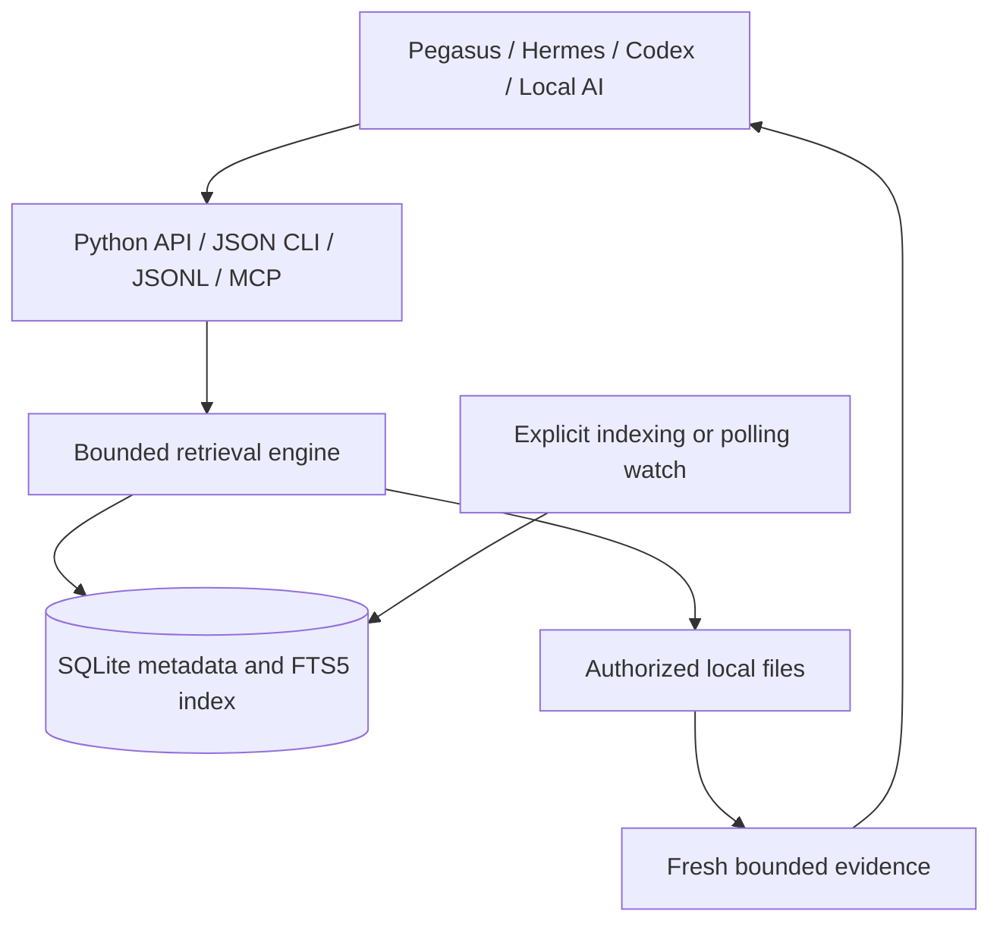

# AgentSearch

**Persistent file and text search that a local AI agent can call.**

[Quick start](#quick-start-on-windows) · [Commands](#commands) · [Agent integration](docs/AGENT_INTEGRATION.md) · [Architecture](docs/ARCHITECTURE.md) · [Windows validation](docs/WINDOWS_VALIDATION.md) · [License](LICENSE)

**Version 0.1.0 · Python 3.11+ · SQLite FTS5 · MIT · Independent implementation**

AgentSearch builds a reusable index of folders you choose. An agent can find a file by an approximate name, search literal text inside files, and read a bounded portion of a result. Every normal CLI response is JSON. Persistent connections are available through JSON lines and a minimal MCP adapter over standard input and output.

The initial target is James Paul Jackson's Windows workflow and future integration with systems such as Pegasus or Hermes. The core also runs on Linux using the same Python API. This package does not modify an existing harness.

## What is included

| Capability | Version 0.1.0 behavior |
| --- | --- |
| Persistent filename and path index | SQLite file metadata survives process restarts; directories are traversed to discover files. |
| Approximate filename search | Ranks name and path candidates; broad fuzzy fallback is bounded. |
| Literal content search | SQLite FTS5 trigram candidates, with matching files reread from disk. |
| Narrow results | Explicit root configuration, optional scope and extension filters. |
| Freshness | Incremental metadata reconciliation through `index`, `grep --fresh`, or foreground polling. |
| Bounded retrieval | Result, line, character, and query budget parameters. |
| Agent interfaces | JSON CLI, JSONL stdio, minimal MCP stdio, Python import. |
| Windows entry point | One PowerShell script, fixed package anchor, UTF-8 I/O, and RootMirror check. |

**Validation status:** the Linux test run collected **33 tests: 31 passed and 2 Windows-specific tests were skipped**. A separate synthetic benchmark passed its **101 known-result checks**. See the [validation receipt](docs/VALIDATION_RESULTS.json) and [benchmark receipt](docs/BENCHMARK_RESULTS.json). Native Windows and PowerShell execution require the checks in [Windows validation](docs/WINDOWS_VALIDATION.md); adding a CI workflow is not evidence that its Windows jobs have run. This is an early functional baseline, with no claim of FSearch speed parity or whole-disk scale.

## Quick start on Windows

Keep the entire `AgentSearch` folder together. Open PowerShell in that folder. Python 3.11 or newer must be available through `py -3` or `python`, and its SQLite build must support FTS5 with the trigram tokenizer.

### 1. Choose a folder

```powershell
.\AgentSearch.ps1 -Action Setup -Root 'C:\Users\jacks\PEGASUS'
```

Replace the example with a directory that exists on your computer. Several roots can be configured together:

```powershell
.\AgentSearch.ps1 -Action Setup -Root 'C:\Projects\Pegasus', 'C:\Projects\Notes'
```

For a first demonstration using only this package's example files:

```powershell
.\AgentSearch.ps1 -Action Setup
```

An initial `Setup` without `-Root` chooses the package's `examples` directory. A later `Setup` without `-Root` preserves the existing configuration. Supplying `-Root` replaces the configured root list. Setup writes configuration; run Index to populate the database.

### 2. Build the index

```powershell
.\AgentSearch.ps1 -Action Index
```

### 3. Search and read

```powershell
.\AgentSearch.ps1 -Action Search -Query 'checkpoint' -Limit 10
.\AgentSearch.ps1 -Action Grep -Query 'checkpoint' -Ext 'py' -PerFile 3
.\AgentSearch.ps1 -Action Grep -Query 'checkpoint' -Ext 'py' -Fresh
.\AgentSearch.ps1 -Action Status
```

Use a returned file path for a bounded read:

```powershell
.\AgentSearch.ps1 -Action Read -Path 'C:\Projects\Pegasus\checkpoint.py' -StartLine 1 -MaxLines 80
```

The path in that example is illustrative; AgentSearch does not create or assume the existence of a Pegasus repository.

### 4. Keep the index current when needed

```powershell
.\AgentSearch.ps1 -Action Watch -IntervalSeconds 5
```

Watch performs repeated directory scans in the foreground. Stop it with Ctrl+C. The interval is a delay between reconciliations, so a scan's own duration also affects freshness. This release has no background service, login task, native Windows event watcher, or NTFS journal reader.

## Commands

| PowerShell action | Purpose | Selected parameters |
| --- | --- | --- |
| `Setup` | Choose roots and anchor the package | `-Root` |
| `Index` | Reconcile the persistent index | — |
| `Search` | Find names and paths | `-Query`, `-Scope`, `-Ext`, `-Limit`, `-BudgetMs` |
| `Grep` | Find literal text | Search parameters, `-PerFile`, `-Fresh`, `-CaseSensitive` |
| `Read` | Read an allowed file | `-Path`, `-StartLine`, `-MaxLines`, `-MaxChars` |
| `Status` | Inspect index state | — |
| `Stdio` | Serve custom JSONL requests | — |
| `Mcp` | Serve minimal MCP tool requests | — |
| `Watch` | Reconcile repeatedly in foreground | `-IntervalSeconds` |
| `Test` | Run the unit test suite | — |

The script discovers Python and runs it with an argument array. It never assembles search input into an executable shell command. It anchors paths at `$PSScriptRoot`, checks `state/rootmirror.json`, and returns to the package directory. If you move the package, run Setup again to re-anchor it; supply `-Root` when the indexed folder locations also change.

### Direct Python CLI

From the package directory, on Windows or Linux:

```text
python -m agentsearch --config config/search.json --db state/index.sqlite3 config --root examples
python -m agentsearch --config config/search.json --db state/index.sqlite3 index
python -m agentsearch --config config/search.json --db state/index.sqlite3 search checkpoint --limit 10
python -m agentsearch --config config/search.json --db state/index.sqlite3 grep checkpoint --ext py --fresh
python -m agentsearch --config config/search.json --db state/index.sqlite3 status
python -m unittest discover -s tests -v
```

Normal source execution requires no pip installation. Optional `pip install .` uses the package build metadata and exposes an `agentsearch` console command; the build environment may need setuptools from a package index. For an installed package, supply explicit writable `--config` and `--db` paths: defaults beside the installed module may not be writable or suitable for local state.

## Agent contract

The four MCP tools are `file_search`, `content_search`, `read_file`, and `index_status`. Index creation and root changes remain explicit local operations. See [Agent integration](docs/AGENT_INTEGRATION.md) for launch configuration, JSONL examples, and a harness adoption checklist.

An agent should use this sequence:

1. Search with a narrow scope and small result limit.
2. Inspect the result's completeness and truncation information.
3. Read relevant files using the returned paths and line locations.
4. Refresh or broaden the search when a negative result needs stronger evidence.

AgentSearch locates evidence. The connected model interprets it. It does not learn tasks, train a model, or alter an agent's memory on its own.

## Coverage and freshness

The default content ceiling is **2 MiB per file**. Default directory exclusions include `.git`, `node_modules`, `__pycache__`, `.venv`, `venv`, `target`, `dist`, and `build`. Exclusions and the content ceiling are configurable. Files that are not eligible for text indexing may still have filename metadata.

Symlinks and Windows reparse points are skipped. Roots and per-query scope constrain access. Scans compare file size, `mtime_ns`, and `ctime_ns` to determine which content to refresh. An edit that preserves all checked metadata can evade that check. The implementation does not claim a transactionally consistent filesystem snapshot while other programs are writing.

Content search rereads candidate files before reporting matching lines. That prevents a stored snippet from being presented as a current match, but it cannot find a newly matching file excluded by a stale candidate index. Run Index or `Grep -Fresh` when newly created or edited files matter. `-Fresh` reconciles before searching; this reconciliation can take longer than the search budget.

`complete` describes the work performed within the configured coverage and the relevant index snapshot. It never proves that every file on the computer was searched. A result cap, candidate cap, time budget, excluded file, or inaccessible path can matter to an agent's conclusion. Grep caps aggregate returned snippet text at 32,000 characters; snippet, per-file, and search truncation, as well as an incomplete index, are reflected in completion information. Literal queries shorter than three characters cannot benefit from a three-character index and may require a bounded scan.

## Measured baseline and performance expectations

The delivered [benchmark receipt](docs/BENCHMARK_RESULTS.json) records a Linux run with Python 3.12.14 and SQLite 3.53.1 over **2,000 synthetic UTF-8 files**, totaling **1,520,312 content bytes**. Each row below is one fixed query repeated 20 times after one warm-up; timings are in-process and exclude CLI startup.

| Query case | p50 | p95 | Complete responses |
| --- | ---: | ---: | ---: |
| Exact filename | 0.6984 ms | 0.8432 ms | 20/20 |
| Filename with a transposition typo | 351.7140 ms | 364.2043 ms | 0/20 |
| Literal content with punctuation | 0.8178 ms | 0.9209 ms | 20/20 |
| Two-character literal | 244.4205 ms | 276.7961 ms | 20/20 |
| Unicode literal | 0.2608 ms | 0.4247 ms | 20/20 |

The expected target was returned in all **100 repeated query checks**, including the fuzzy case, whose responses were all marked incomplete. One fresh-after-write check also passed, making **101/101 checks**. These are checks of the chosen targets, not a measurement of general recall. The first index took **460.7267 ms** with an empty database; operating-system caches were not flushed. The separate fresh-after-write search took **54.0684 ms**, including reconciliation.

The measurements identify clear next work: broad fuzzy matching and short literals cost far more than selective indexed lookups. They do not establish a speed comparison with FSearch or predict Windows or whole-disk performance.

To repeat the synthetic experiment:

```text
python examples/benchmark.py --files 2000 --repetitions 20 --output state/benchmark-local.json
```

The first index requires directory enumeration and content reads. Later reconciliations still enumerate configured trees, but unchanged eligible content can reuse the existing index. Foreground polling therefore has a filesystem cost even when no files change.

The trigram index is intended to reduce the number of files inspected for eligible literal queries. Broad fuzzy name searches and short content queries can do substantially more work. Process startup, disk speed, repository shape, file size, Unicode content, and result limits affect measured latency. Measure the actual workload before choosing polling frequency or replacing an existing retrieval tool.

[FSearch](https://github.com/noahdunnagan/fsearch) supplied the inspiration for a reusable local search layer. Its macOS implementation uses different native primitives and data structures. AgentSearch's benchmark results, when collected, must be reported independently with their corpus and hardware. See [Provenance](THIRD_PARTY.md).

## Package map

| Path | Role |
| --- | --- |
| `AgentSearch.ps1` | Single Windows entry point |
| `agentsearch/` | Core engine and agent interfaces |
| `examples/` | Small local demonstration corpus |
| `tests/` | Repeatable functional and boundary tests |
| `config/search.json` | Local root configuration, created by Setup |
| `state/index.sqlite3` | Local persistent index, created at runtime |
| `state/rootmirror.json` | Local package anchor, created by PowerShell Setup |
| `docs/` | Architecture, integration, Windows validation |
| `.github/workflows/test.yml` | Linux and Windows CI matrix to run after publication |

Keep indexed state and configuration local. The database contains searchable representations of text from the roots you select. A clean source distribution should omit generated databases, machine-specific root configuration, and RootMirror state.

## Next engineering step

Run the Windows acceptance checks on the ROG, using one explicitly chosen repository. Compare common searches against direct inspection, measure first-index and incremental costs, then connect the four retrieval tools to one harness. Native Windows change notifications and journal replay are subsequent acceleration work, described in [Architecture](docs/ARCHITECTURE.md).

## License

[MIT](LICENSE). Created for James Paul Jackson. [Third-party and provenance notes](THIRD_PARTY.md).


---

## The agent-first architecture



**Core principle:** the index finds candidates; the filesystem provides evidence; the agent interprets it. File contents are data, not instructions.

### Retrieval playbook

1. Search names using a small limit and narrow scope.
2. Search file contents for the specific symbol or error.
3. Inspect `complete`, truncation and freshness metadata.
4. Read only the relevant lines; preserve the source path.
5. Validate a proposed code change using independent tests.

## Recorded performance (synthetic Linux corpus)

| Query | Warm median |
|---|---:|
| Exact filename | 0.70 ms |
| Indexed literal text | 0.82 ms |
| Unicode literal | 0.26 ms |
| Fuzzy filename typo | 351.7 ms |
| Two-character text | 244.4 ms |

These are the prior v0.1.0 benchmark figures on 2,000 synthetic files, not independent verification, Windows measurements, or end-to-end agent timings. See `docs/BENCHMARK_RESULTS.json`. Fast literal retrieval does not establish lower task-level cost or improved correctness.

## Security and trust boundaries

- Choose **explicit, narrow roots**. Indexed paths and retrieved excerpts can contain secrets.
- Treat retrieved file content as **untrusted input**; never obey embedded commands as agent instructions.
- MCP and JSONL are **local stdio transports**, not authenticated network services.
- Root restrictions and exclusions are not a substitute for OS-level sandboxing.
- Respect `complete`, query budgets, truncation, file eligibility and freshness before treating a negative result as meaningful.
- The index is **not** a backup, a provenance authority, or a long-term learning mechanism.

## Engineering roadmap

| Priority | Improvement | Reason | Status |
|---|---|---|---|
| P0 | Native Windows/PowerShell acceptance | Prove intended host works | Pending |
| P0 | Adversarial path, encoding and protocol audit | Secure agent access | Pending |
| P1 | Indexed fuzzy candidate pruning | Reduce slow typo-search tail | Planned |
| P1 | Short-pattern search acceleration | Reduce scan fallback | Planned |
| P1 | Native Windows change notifications and USN recovery | Reduce polling and stale windows | Planned |
| P1 | Multi-agent concurrency and cancellation tests | Confirm safe contention | Planned |
| P2 | Symbol/dependency graph with evidence hashes | Targeted code intelligence | Research |
| P2 | Cost-aware retrieval A/B benchmark | Measure token, latency and correctness | Research |
| P3 | Optional Rust acceleration behind stable tool contract | Scale without breaking harnesses | Research |

**Integration target:** Pegasus, Hermes, Codex and local models can use the same four retrieval tools. Integration into any existing harness is **not** included or claimed.

## Release note

**v0.1.1** is a documentation and design upgrade: new infographic, technical review, security guidance, and roadmap. The underlying search engine and adapters are unchanged from v0.1.0. Native Windows verification remains outstanding.
